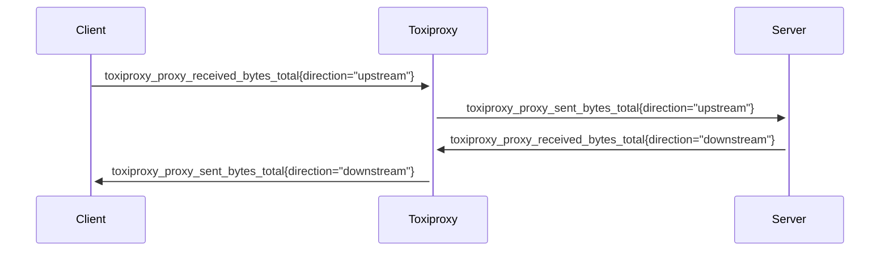

# Metrics

- [Metrics](#metrics)
    - [Runtime Metrics](#runtime-metrics)
    - [Proxy Metrics](#proxy-metrics)
      - [toxiproxy_proxy_received_bytes_total / toxiproxy_proxy_sent_bytes_total](#toxiproxy_proxy_received_bytes_total--toxiproxy_proxy_sent_bytes_total)

### Runtime Metrics

To enable runtime metrics related to the state of the go runtime, build version, process info, use the `-runtime-metrics` flag.

For more details, see below:
- [NewGoCollector](https://pkg.go.dev/github.com/prometheus/client_golang/prometheus/collectors#NewGoCollector)
- [NewBuildInfoCollector](https://pkg.go.dev/github.com/prometheus/client_golang/prometheus/collectors#NewBuildInfoCollector)
- [NewProcessCollector](https://pkg.go.dev/github.com/prometheus/client_golang/prometheus/collectors#NewProcessCollector)

### Proxy Metrics

To enable metrics related to toxiproxy internals, use the `-proxy-metrics` flag.
#### toxiproxy_proxy_received_bytes_total / toxiproxy_proxy_sent_bytes_total

The total number of bytes received/sent on a given proxy link in a given direction

**Type**

Counter

**Labels**

| Label     | Description                    | Example               |
|-----------|--------------------------------|-----------------------|
| direction | Direction of the link          | upstream / downstream |
| listener  | Listener address of this proxy | 0.0.0.0:8080          |
| proxy     | Proxy name                     | my-proxy              |
| upstream  | Upstream address of this proxy | httpbin.org:80        |

